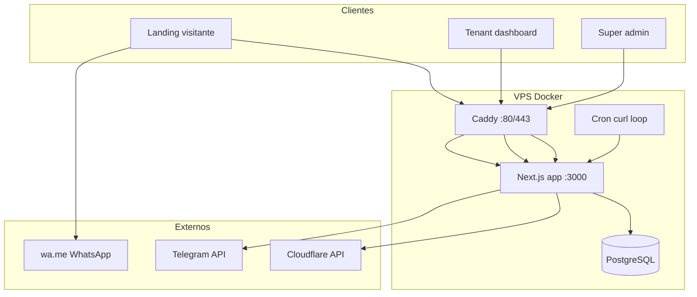
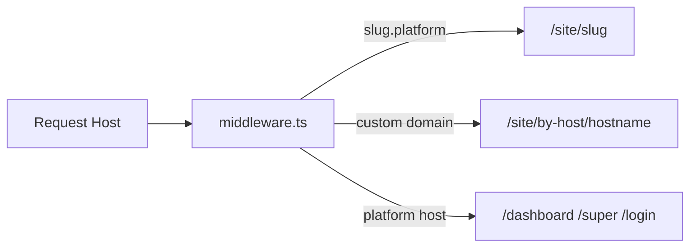

# AUDITORIA COMPLETA DO PROJETO — Top1Tags

**Data da auditoria:** 2026-09-01  
**Workspace:** `/root/tags-src`  
**Método:** análise estática do código, configs, Docker, CI, Git (somente leitura). Sem alterações ao código de produção.  
**Build completo:** NÃO EXECUTADO (bloqueado no ambiente de auditoria). **Typecheck (`tsc --noEmit`):** executado em container Node 20 — sem erros reportados.

Documentos detalhados: [docs/audit/](docs/audit/)

---

## 1. Resumo executivo

Top1Tags é uma **plataforma multi-tenant invite-only** para parceiros criar **landings de tags de pedágio** (ConectCar, Veloe), conectar **domínios customizados via Cloudflare**, capturar **leads** (formulário/quiz/WhatsApp), **chat ao vivo** e **analytics** de visitas/UTMs. É um **monólito Next.js 16** com PostgreSQL, deploy em **Docker + Caddy** na VPS via **GitHub Actions**.

**Estado:** funcionalidade core aparenta estar implementada e coerente. Há **dívida técnica** relevante: sem testes, sem migrations versionadas, rate limit em memória, settings não aplicados (`leadRetentionDays`, `allowTenantCustomWa`), campos de página não usados (`ctaUrl`). **Working tree local** contém feature WhatsApp multi-número **não commitada**.

---

## 2. Estado atual

| Aspecto | Situação |
|---------|----------|
| Git branch | `main`, up to date com `origin/main` |
| Último commit | `5cee6d3` — fix username optional for db push |
| Alterações locais | 13 arquivos modificados + `app/api/leads/[id]/opened/` (WhatsApp multi-número) |
| Migrations Prisma | **Não existem** — usa `db push` |
| Testes | **Zero** arquivos de teste |
| Lint | **Não configurado** no package.json |
| Node no host auditoria | Não instalado; validação via Docker |

---

## 3. Stack

| Camada | Tecnologia | Versão (package.json) |
|--------|------------|------------------------|
| Runtime | Node.js | 20 (Docker) |
| Framework | Next.js | ^16.3.1 |
| UI | React | ^19.2.8 |
| Auth | next-auth (Auth.js v5 beta) | ^5.0.0-beta.32 |
| ORM | Prisma | 5.22.0 |
| DB | PostgreSQL | 16 (image) |
| Validação | Zod | ^4.4.3 |
| Senha | bcryptjs | ^3.0.3 |
| CDN/DNS | Cloudflare API | cloudflare ^7.0.0 |
| Proxy | Caddy | 2-alpine |
| TypeScript | ^5.7.0 |
| Package manager | npm (package-lock.json presente) |

**Monorepo:** não — single app.

---

## 4. Arquitetura



**Fluxo de host:**



Ver [docs/audit/INFRASTRUCTURE.md](docs/audit/INFRASTRUCTURE.md).

---

## 5. Estrutura de arquivos

```
top1tags/
├── app/                    # Next.js App Router (páginas + API routes)
│   ├── api/                # 25 route handlers REST
│   ├── dashboard/          # Tenant UI
│   ├── super/              # Super admin UI
│   ├── site/               # Landings públicas (preview + custom domain)
│   ├── login, cadastro/    # Auth UI
│   ├── globals.css
│   └── layout.tsx
├── components/             # React components (30 tsx)
│   └── landings/           # ConectCar, Veloe, chat widget
├── lib/                    # 13 módulos (auth, prisma, cloudflare, config...)
├── prisma/
│   ├── schema.prisma       # Schema completo
│   └── seed.ts             # Super admin seed
├── public/brands/          # Assets ConectCar (e Veloe se houver)
├── scripts/                # Docker entrypoint, health, dumps
├── .github/workflows/      # deploy + platform-health
├── Dockerfile
├── docker-compose.dev.yaml
├── docker-compose.prod.yaml
├── Caddyfile
├── middleware.ts           # Host-based rewrites
├── auth.ts                 # NextAuth config
├── next.config.ts          # output: standalone
└── docs/audit/             # Esta auditoria (detalhes)
```

**Não listado:** `node_modules`, `.next`, `.git`, `scripts/conectcar-dump/` (legado visual).

| Diretório | Função |
|-----------|--------|
| `app/api` | Backend HTTP (Route Handlers) |
| `app/dashboard` | Gestão páginas, leads, chat tenant |
| `app/super` | Convites, tenants, settings globais |
| `app/site` | Renderização SSR das landings |
| `components` | UI reutilizável + landings |
| `lib` | Domínio, infra, helpers |
| `prisma` | Schema + seed |
| `scripts` | Entrypoint prod, notificações CI |

---

## 6. Frontend

Resumo: Next.js App Router, SSR para dashboard/super, landings com client components para funil/chat.

**Mapa página → APIs:** ver [docs/audit/FRONTEND.md](docs/audit/FRONTEND.md).

---

## 7. Backend

25 rotas em `app/api/**/route.ts`. Sem camada service/repository formal — lógica nos handlers + `lib/*`.

Tabela completa e fluxos: [docs/audit/BACKEND.md](docs/audit/BACKEND.md).

---

## 8. Banco

PostgreSQL + Prisma. 15 modelos principais de negócio + Auth.js tables.

Detalhe por tabela: [docs/audit/DATABASE.md](docs/audit/DATABASE.md).

---

## 9. APIs e integrações

| Nome | Finalidade | Auth env | Status |
|------|------------|----------|--------|
| **Cloudflare** | Criar zone, SSL flexible, validar NS | `CLOUDFLARE_API_TOKEN`, `CLOUDFLARE_ACCOUNT_ID` | ✅ Implementado |
| **Telegram** | Alertas lead + deploy fail + health | `telegramBotToken` (DB global) + GH secrets | 🟡 Sem retry robusto |
| **WhatsApp (wa.me)** | Abrir chat com lead | — (URL gerada server) | ✅ / 🟡 multi-número local |
| **Auth.js** | Sessão JWT | `AUTH_SECRET` | ✅ |

`GOOGLE_MAPS_API_KEY`: documentado em CONFIGURACAO_DEPLOY, **não referenciado no código**.

---

## 10. Autenticação e segurança

| Tópico | Implementação |
|--------|---------------|
| Login | Vulgo + senha → Credentials provider |
| Cadastro | Token convite + POST /api/register |
| Sessão | JWT (strategy jwt), cookie Auth.js |
| Roles | SUPER_ADMIN, TENANT_ADMIN |
| Impersonação | Cookie HMAC `t1t_impersonate`, super only |
| 2FA / reset senha | Não existe |
| API keys tenant | Não existe |

**Mapa permissões:**

| Ação | SUPER (normal) | SUPER (impersonando) | TENANT_ADMIN |
|------|----------------|----------------------|--------------|
| /super | ✅ | ✅ | ❌ |
| /dashboard tenant próprio | ✅ (tenant teste) | ✅ tenant impersonado | ✅ |
| Ver página outro tenant | ✅ | ❌ (só impersonado) | ❌ |
| Público leads/chat | ✅ | — | — |

Análise defensiva: [docs/audit/SECURITY.md](docs/audit/SECURITY.md).

---

## 11. Infraestrutura

Docker Compose prod: postgres + app + cron + caddy. Deploy SSH GitHub Actions.

Detalhe: [docs/audit/INFRASTRUCTURE.md](docs/audit/INFRASTRUCTURE.md).

---

## 12. Docker

- **Build:** multi-stage, standalone Next
- **Entrypoint:** `db push` + seed + start (schema auto-sync em prod)
- **Healthcheck:** GET `/login` com Host platform domain
- **Volumes:** postgres-data, caddy-data/config

---

## 13. CI/CD

| Workflow | Evento | Ação |
|----------|--------|------|
| Deploy Top1Tags | push main + path filters | build image, SCP, compose up |
| Platform Health | cron 5min | fetch PLATFORM_HEALTH_URL, Telegram |

Secrets: `INFRA_*`, `PLATFORM_TELEGRAM_*`, `PLATFORM_HEALTH_URL`.

---

## 14. Variáveis de ambiente

| VARIÁVEL | Uso | Obrigatória prod | .env.example | Fallback |
|----------|-----|------------------|--------------|----------|
| `DATABASE_URL` | Prisma | Sim | Sim | — |
| `AUTH_SECRET` | Auth + impersonate HMAC | Sim | Sim | NEXTAUTH_SECRET |
| `PLATFORM_DOMAIN` | Host routing | Sim | Sim | top1tags.dev |
| `APP_URL` | Links convite | Sim | Sim | https://PLATFORM |
| `APP_DOMAIN` | Caddy env (doc) | Parcial | Sim | — |
| `CLOUDFLARE_API_TOKEN` | Domínios | Para custom domain | Sim (vazio) | "" → erro ao usar |
| `CLOUDFLARE_ACCOUNT_ID` | Domínios | Para custom domain | Sim (vazio) | "" |
| `CRON_SECRET` | validate-ns | Recomendado | Sim | "" → cron 401 |
| `TRACKING_IP_SALT` | Hash IP | Recomendado | Sim | dev salt |
| `SUPER_ADMIN_EMAIL` | Seed | Sim | Sim | default |
| `SUPER_ADMIN_PASSWORD` | Seed | Sim | Sim | **default fraco** |
| `SUPER_ADMIN_NAME` | Seed | Opcional | Sim | — |
| `SUPER_ADMIN_USERNAME` | Seed, env.ts | Opcional | **Não** | "admin" |
| `POSTGRES_*` | Compose prod | Sim (compose) | Não (só INFRA_ENV doc) | defaults compose |
| `NODE_ENV` | Runtime | Auto | — | — |
| `GOOGLE_MAPS_API_KEY` | — | Não | Não | **não usado** |
| `PLATFORM_TELEGRAM_*` | GH Actions | Opcional | Não | — |
| `PLATFORM_HEALTH_URL` | GH Actions | Opcional | Não | — |

**Nunca commitar `.env`** — listado em `.gitignore`.

---

## 15. Funcionalidades

Matriz completa: [docs/audit/FUNCTIONALITY.md](docs/audit/FUNCTIONALITY.md).

---

## 16. Fluxos

### 16.1 Onboarding tenant
Super → POST /api/invites → link `/cadastro?invite=TOKEN` → POST /api/register → Tenant + User → login → /dashboard.

### 16.2 Criar landing
Dashboard → POST /api/pages (brand, template, configJson) → preview `{slug}.platform` → editar config/domínio.

### 16.3 Custom domain
POST /api/pages/[id]/domain → Cloudflare create zone + SSL flexible → tenant aponta NS → cron/manual validate → `nsStatus=active` → page `published` → `/site/by-host/hostname`.

### 16.4 Lead formulário + WhatsApp
Visitante → EngagementBlock → POST /api/leads → server `pickWhatsAppNumber` → salva Lead → retorna `whatsappUrl` → `window.open` → POST /api/leads/[id]/opened se abriu.

### 16.5 Chat
Visitante → ConectCarChatWidget → POST /api/chat/conversations → Lead mode=chat + Conversation → polling GET/POST com visitorToken → agente responde via /api/chat/inbox/[id].

### 16.6 Tracking
TrackingBeacon → POST /api/t eventType=view → TrackEvent com ipHash, UTMs, device.

---

## 17. Testes

| Item | Status |
|------|--------|
| Framework | **Nenhum** |
| Unit / integration / E2E | **Zero arquivos** |
| Scripts npm test | **Não existem** |
| Cobertura | 0% |

---

## 18. Build / lint / typecheck

| Comando | Configurado | Resultado auditoria |
|---------|-------------|---------------------|
| `npm run build` | Sim (`prisma generate && next build`) | **NÃO EXECUTADO** |
| `npm run dev` | Sim | NÃO EXECUTADO |
| `npx tsc --noEmit` | Não script, tsconfig strict | **OK** (Docker Node 20) |
| `eslint` | Não | N/A |
| `npm test` | Não | N/A |

---

## 19. Problemas encontrados

| Severidade | Problema | Arquivo |
|------------|----------|---------|
| CRÍTICO | Senha default em example + seed em cada deploy | `.env.example`, seed, docker-entrypoint |
| CRÍTICO | opened endpoint público sem prova de abertura WA | `api/leads/[id]/opened/route.ts` |
| ALTO | Leads aceitos em páginas draft (preview público) | `api/leads/route.ts`, `site/[slug]/page.tsx` |
| ALTO | Rate limit Map in-memory | `lib/tracking.ts` |
| ALTO | Schema WA local não commitado / prod drift | git status, prisma schema |
| MÉDIO | Analytics carrega todos eventos em RAM | `api/pages/[id]/analytics/route.ts` |
| MÉDIO | `ctaUrl`/`affiliateCode` não usados | landings vs schema |
| MÉDIO | `leadRetentionDays` sem purge job | settings vs código |
| BAIXO | CtaButton morto | `components/CtaButton.tsx` |

---

## 20. Segurança

Ver [docs/audit/SECURITY.md](docs/audit/SECURITY.md).

---

## 21. Dívida técnica

Ver [docs/audit/TECH_DEBT.md](docs/audit/TECH_DEBT.md).

---

## 22. Código morto / legado

| Item | Tipo |
|------|------|
| `components/CtaButton.tsx` | Componente não importado |
| `scripts/conectcar-dump/` | Dump HTML/CSS estático (~50 arquivos) |
| Page fields `ctaUrl`, `affiliateCode`, `ctaLabel` | DB only |
| `allowTenantCustomWa` | Setting sem enforcement |
| Account/Session models | OAuth tables sem provider OAuth |
| `.agents/skills/` | Documentação agente Prisma |

---

## 23. Documentação

| Doc | Avaliação |
|-----|-----------|
| README.md | ✅ Alinhado com stack e fluxo |
| CONFIGURACAO_DEPLOY.md | ✅ Detalhado para GH Actions + VPS |
| .env.example | 🟡 Falta SUPER_ADMIN_USERNAME; senha exemplo fraca |
| GOOGLE_MAPS em deploy doc | 🔴 Funcionalidade inexistente |
| AGENTS.md | Next.js agent rules (auto) |

---

## 24. Git status

```
Branch: main (up to date origin/main)
Modified (não staged):
  app/api/leads/route.ts
  app/api/pages/[id]/leads/export/route.ts
  app/dashboard/page.tsx
  app/globals.css
  components/CreatePageForm.tsx
  components/EngagementBlock.tsx
  components/EngagementConfigFields.tsx
  components/LeadsPanel.tsx
  components/PageConfigEditor.tsx
  components/PageDashboardCard.tsx
  lib/page-config.ts
  lib/settings.ts
  prisma/schema.prisma
Untracked:
  app/api/leads/[id]/opened/
  docs/audit/ (esta auditoria)
```

Últimos commits:
- `5cee6d3` fix: username optional for db push
- `d0e015b` feat: login/cadastro vulgo + senha
- `e6f637f` fix: healthcheck platform host
- `571ccf2` fix: app container root for prisma push

---

## 25. Arquivos críticos

| Arquivo | Função |
|---------|--------|
| `auth.ts` | Autenticação |
| `middleware.ts` | Multi-host routing |
| `prisma/schema.prisma` | Modelo de dados |
| `lib/page-config.ts` | Funil + WhatsApp config |
| `lib/settings.ts` | Settings efetivos + Telegram + audit |
| `lib/cloudflare.ts` | Integração CF |
| `app/api/leads/route.ts` | Core conversão |
| `components/EngagementBlock.tsx` | UX funil |
| `components/landings/ConectCarLanding.tsx` | Landing principal |
| `docker-compose.prod.yaml` + `Dockerfile` | Deploy |
| `.github/workflows/deploy.yaml` | CI/CD |

---

## 26. Dependências externas

**Produção runtime:** @prisma/client, next, next-auth, bcryptjs, cloudflare, zod, react, @auth/prisma-adapter.

**Possivelmente subutilizadas:** cloudflare SDK só em lib/cloudflare (usado). tsx só seed/entrypoint.

**Sem lock de versão patch** em alguns ^ deps — aceitável com lock file.

**npm audit:** NÃO EXECUTADO.

---

## 27. O que funciona hoje

| Área | Confiança |
|------|-----------|
| Login / sessão | Alta (código + auth flow claro) |
| CRUD páginas tenant | Alta |
| Preview slug + middleware | Alta |
| Custom domain + CF | Alta **se** credenciais CF válidas |
| Tracking /api/t | Alta |
| Leads form/quiz | Alta |
| Chat visitante ↔ agente | Alta |
| Super admin invites/settings | Alta |
| WhatsApp multi-número | Média — **código local, não em main** |
| Produção live | NÃO CONFIRMADO (depende VPS/secrets) |

---

## 28. O que falta

- Testes automatizados
- Migrations versionadas
- Purge leadRetentionDays
- Enforcement allowTenantCustomWa
- Uso de ctaUrl/affiliate na landing
- Lint/CI typecheck formal
- Rate limit distribuído
- OAuth ou remoção tables Account órfãs
- Staging environment
- Observabilidade (APM/logs)

---

## 29. Prioridades

### FASE 0 — Riscos críticos
1. Trocar credenciais default super admin em prod
2. Revisar seed em entrypoint (não resetar senha involuntariamente)
3. Proteger ou validar `/api/leads/[id]/opened`
4. Commit + deploy schema `whatsappNumberUsed` ou revert

### FASE 1 — Estabilização
5. Adicionar `prisma migrate` em vez de só push
6. Rate limit com Redis ou proxy
7. Bloquear leads em draft ou exigir published

### FASE 2 — Arquitetura
8. Service layer para leads/domains/chat
9. Paginação analytics

### FASE 3 — Segurança
10. CAPTCHA em leads/chat públicos
11. Não enviar número WA completo no Telegram

### FASE 4 — Testes
12. Vitest + testes API leads/auth
13. E2E smoke login + create page

### FASE 5–7
Performance, observabilidade, produto (CTA afiliado, retenção, etc.)

---

## 30. Plano de melhoria

Sequência recomendada alinhada às fases acima. Detalhe em [docs/audit/TECH_DEBT.md](docs/audit/TECH_DEBT.md).

---

## Inventário de arquivos estruturais

| Arquivo | Função | Dependências | Usado por | Status |
|---------|--------|--------------|-----------|--------|
| `auth.ts` | NextAuth credentials JWT | prisma, bcrypt, zod | API auth, getAppSession | ativo |
| `middleware.ts` | Rewrite host → site routes | lib/env | todas requests não-api | ativo |
| `lib/prisma.ts` | Prisma client singleton | @prisma/client | todas APIs | ativo |
| `lib/page-config.ts` | Config funil + WA + pick número | — | Engagement*, APIs leads | ativo (WA estendido local) |
| `lib/domains.ts` | Validação NS | cloudflare, prisma | cron, validate API | ativo |
| `lib/impersonation.ts` | Cookie impersonate HMAC | env authSecret | super, auth-helpers | ativo |
| `components/CtaButton.tsx` | CTA com tracking | TrackingBeacon | **ninguém** | legado/morto |
| `lib/conectcar-plans.ts` | Dados planos CC | — | ConectCarPlansGrid? | parcial |

---

### TOP 10 problemas mais importantes

1. Sem testes automatizados
2. `db push` em prod sem migrations versionadas
3. Seed no entrypoint pode resetar super admin
4. Credenciais default em `.env.example`
5. Rate limit in-memory
6. Endpoint público `leads/[id]/opened`
7. Leads em páginas draft
8. Alterações WA não commitadas / schema drift
9. Settings `leadRetentionDays` não implementados
10. Analytics sem paginação (memory)

### TOP 10 melhorias com maior impacto

1. Suite de testes smoke (auth + lead + domain mock CF)
2. Prisma migrate + remover seed automático agressivo
3. Commit/deploy feature WA ou documentar estado
4. Redis rate limit ou Cloudflare rate rules
5. Paginação analytics/leads
6. Implementar purge retenção leads
7. Conectar `ctaUrl` nas landings ou remover campos
8. ESLint + typecheck no CI
9. Telegram: mascarar número WA
10. Health endpoint dedicado `/api/health`

### TOP 10 arquivos para entender primeiro

1. `prisma/schema.prisma`
2. `auth.ts` + `lib/auth-helpers.ts`
3. `middleware.ts` + `lib/env.ts`
4. `lib/page-config.ts`
5. `app/api/leads/route.ts`
6. `components/EngagementBlock.tsx`
7. `components/landings/ConectCarLanding.tsx`
8. `lib/cloudflare.ts` + `lib/domains.ts`
9. `docker-compose.prod.yaml` + `scripts/docker-entrypoint.js`
10. `.github/workflows/deploy.yaml`

### PONTOS QUE PRECISAM DE CONFIRMAÇÃO MANUAL

- Estado real da VPS produção (containers healthy?)
- `INFRA_ENV` em produção usa senhas fortes?
- Cloudflare token scopes e quota
- Volume de leads/eventos no DB
- `npm run build` sucesso no CI último deploy
- Coluna `whatsappNumberUsed` existe em prod DB?
- Assets `public/brands` completos no image Docker

### PERGUNTAS EM ABERTO

- Deve preview (`draft`) aceitar leads reais?
- `allowTenantCustomWa` terá enforcement ou remoção?
- OAuth planejado (tables Account existem)?
- Multi-instância app no futuro?
- Retenção 180d: purge automático ou manual?

---

*Auditoria gerada por análise estática. Nenhum secret foi incluído neste documento.*
