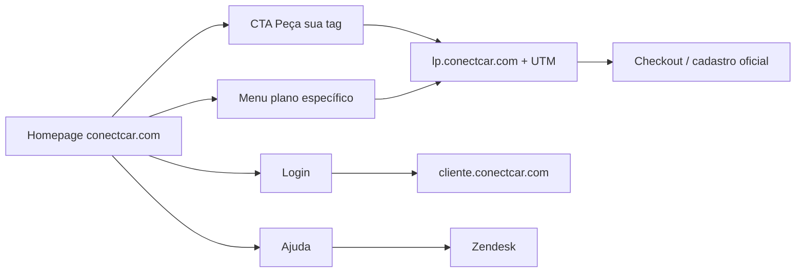

# Auditoria UX/UI — conectcar.com (referência)

**Data:** 2026-09-01  
**Método:** Playwright headless (`scripts/audit-conectcar-ui.mjs`) — inspeção estrutural, computed styles, screenshots locais.  
**Dados brutos:** `docs/reference/conectcar-audit-raw.json`  
**Screenshots (estudo local):** `docs/reference/conectcar-screenshots/`

> **Nota legal:** Esta auditoria descreve padrões de interface para inspiração no Top1Tags. **Não** reproduz logotipos, banners, fotos, ilustrações, textos longos, código-fonte ou assets proprietários. Implementação futura deve usar **identidade visual original** ou assets licenciados pelo parceiro.

---

## 1. Páginas navegáveis encontradas

O site principal é WordPress + Elementor. Muitos itens de menu apontam a **subdomínios** (`lp.conectcar.com`, `blog.conectcar.com`, `cliente.conectcar.com`) ou **Zendesk**, não a paths simples em `conectcar.com`.

### Domínio `conectcar.com` (confirmadas na auditoria)

| Path | Observação |
|------|------------|
| `/` | Homepage principal (planos, comparativo, frotas, app, footer) |
| `/como-funciona/` | Conteúdo editorial (descontos pedágio, grids de cards) |
| `/free-flow/` | Artigo/blog layout |
| `/parcerias/` | Parcerias |
| `/white-label/` | Soluções white-label |
| `/comocolar/` | Como colar tag |
| `/onde-usar/` | Onde usar |
| `/formas-de-pagamento/` | Formas de pagamento |
| `/comprenaloja/` | Compre na loja |
| `/acompanhar-pedido/` | Rastreio |
| `/sobre-a-conectcar/` | Institucional |
| `/certificados-e-premiacoes/` | Certificações |
| `/seguranca/` | Segurança |
| `/privacidade-de-dados/` | Privacidade |
| `/nova-politica-de-privacidade-da-conectcar/` | Política |
| `/wp-content/uploads/*` | PDFs (termos, regulamentos, manuais) |

### Paths que retornam 404 (menu usa dropdown, não URL direta)

`/para-voce/`, `/para-empresas/`, `/ativar/`, `/blog/`, `/ajuda/` — páginas “não encontrada” com layout de blog/404.

### Landing pages de conversão (`lp.conectcar.com`)

Destino principal dos CTAs “Peça sua tag” (com UTMs):

- `/planos`, `/planocompleto`, `/escolha-o-lado-bom-plano-basico`, `/escolha-o-lado-bom-plano-flex`
- `/plano-free-flow`, `/tag-porto-auto-b`, `/conectcarempresas`
- `/free-flow`, `/beneficios`, `/desconto-no-pedagio-e-free-flow`, `/tpa`

### Apps e suporte (externos)

- `cliente.conectcar.com` — login cliente / ativação
- `cliente-frotas.conectcar.com` — frotas
- `blog.conectcar.com` — blog
- `atendimentoconectcar.zendesk.com` — ajuda / FAQ
- `conveniado.conectcar.com`, checkout, etc.

**Total de links únicos no header/footer da homepage:** ~60+ (ver `navLinks` no JSON bruto).

---

## 2. Estrutura do header

| Elemento | Medidas / estilo observado |
|----------|---------------------------|
| Container | `header.site-header.has-menu`, altura ~**98px** |
| Fundo | `rgb(255, 106, 56)` — laranja ConectCar |
| Logo | Esquerda, link home |
| Navegação desktop | Mega-menu com grupos: Para Você, Para Empresas, Ativar, Como Funciona, Compre na Loja, Blog, Free Flow, Ajuda, Login |
| CTA fixo | **“Peça sua tag”** — pill laranja `rgb(255, 99, 56)`, radius **50px**, font **15px / 700**, padding ~`9px 30px` |
| Mobile | Botão **Menu / Fechar**; overlay fullscreen com mesma árvore de links |
| Sticky | Header fixo no topo durante scroll |

Submenus (dropdown) por hover/click nos itens com `#` ou filhos diretos no overlay mobile.

---

## 3. Seções da homepage (ordem)

Ordem inferida por seções Elementor + headings (altura > 40px):

1. **Barra de alerta** — aviso fraude/atendentes falsos (texto vermelho/destaque)
2. **Hero / carrossel principal** (~470px desktop) — banners promocionais rotativos
3. **Barra secundária mobile** (alerta duplicado em breakpoint menor)
4. **Grid/carrossel de planos** — “Escolha o plano que mais combina com você” + 5 cards (Completo★, Básico, Flex, Free Flow, Tag+Assistência)
5. **Tabela comparativa** — “Compare e escolha o plano para seu perfil de uso”
6. **ConectCar Frotas** — bloco azul institucional + CTA “Conheça o ConectCar Frotas”
7. **Variante mobile Frotas** (texto reorganizado)
8. **“Presente por onde você for”** — título + CTA “Consulte Onde Usar”
9. **Ícones “onde usar”** — 4 categorias (pedágios, Free Flow, estacionamentos, escolas)
10. **Pagamento com a tag** — fundo bege `rgb(247, 242, 237)`, split texto + imagem, CTA “Saiba mais”
11. **Parceiros** — título + faixa/carrossel de logos clicáveis
12. **White-label / parceiro B2B** — fundo escuro/laranja, CTA “Seja nosso parceiro”
13. **App ConectCar** — copy + badges App Store / Google Play + mockup telefone
14. **Footer** — institucional, políticas, regulamentos, social, apps, acionistas/selos

**Não há formulário de lead na homepage** — conversão vai para LPs externas.

---

## 4. Tipos de hero / banner

| Tipo | Uso |
|------|-----|
| **Carrossel full-width** | Hero principal — imagens/GIF campanha, dots ou swipe |
| **Alert strip** | Faixa textual segurança (acima ou abaixo do hero) |
| **Card-hero em planos** | Cada plano com mini-hero (badge, preço, bullets) |
| **Split banner** | Frotas, pagamento, app — texto + imagem lateral |
| **Logo strip** | Parceiros — horizontal scroll |

Nosso `ConectCarHeroCarousel` cobre o tipo 1 com 6 slides estáticos locais.

---

## 5. Padrões de cards

### Cards de plano (homepage)

- Largura ~**344–400px**, altura ~**500px** (tokens históricos em `scripts/conectcar-dump/meta.json`)
- Radius **12px**, sombra `0 4px 6px rgba(0,0,0,0.1)`
- Título H3 laranja **24px / 600** (Roboto)
- Badge promocional no Completo (“mais vendido”)
- Lista de benefícios curtos
- CTA pill “Peça sua tag” repetido em cada card

### Cards editoriais (blog)

- Grid de posts com imagem, título, “Mais lidas”
- Usado em `/como-funciona/`, `/free-flow/`

### Cards “onde usar”

- Ícone + título + uma linha de descrição, 4 colunas desktop

---

## 6. CTAs

| CTA | Estilo | Destino típico |
|-----|--------|----------------|
| Peça sua tag | Laranja pill, branco, 700 | `lp.conectcar.com/*` + UTM |
| Conheça o ConectCar Frotas | Azul `rgb(41, 59, 138)`, pill | LP empresas |
| Consulte Onde Usar | Laranja pill | `#` ou `/onde-usar/` |
| Saiba mais | Laranja pill, padding maior | LP pagamento |
| Seja nosso parceiro | Branco pill, texto dourado | LP parceiro |
| Login / Cliente | Texto link no menu | `cliente.conectcar.com` |

Altura de botão referência: **~47px**, radius **24px** (dump oficial).

---

## 7. Grids

- **Planos:** 5 colunas desktop → carrossel horizontal mobile (Swiper/Elementor)
- **Onde usar:** 4 colunas ícones
- **Parceiros:** faixa horizontal com overflow
- **Blog:** grid 2–3 colunas (`grids: 10` em páginas editoriais)
- **Footer:** 4–5 colunas links + aside social/apps

Breakpoints Elementor: mobile ≤**767px**, tablet ≤**1024px**.

---

## 8. Espaçamentos aproximados

| Contexto | Valor observado |
|----------|----------------|
| Header height | ~98px |
| Hero section | ~470px altura bloco |
| Seção comparativo | ~504px |
| Seção Frotas | ~277–300px (varia breakpoint) |
| Seção parceiros | ~371px |
| App section | ~557px (desktop), padding bottom grande (~170px) |
| Padding seções Elementor | frequentemente `0` (controlado por widgets internos) |
| Gap cards plano | ~20–28px |
| Footer padding | blocos internos com padding 14–48px |

Nosso `.cc-section` usa padding vertical ~48–64px — alinhado em espírito, não pixel-perfect.

---

## 9. Tipografia aparente

| Uso | Família | Tamanho / peso |
|-----|---------|----------------|
| H1 homepage (SEO) | Lato | 36px / 500 |
| H2 seções laranja | Roboto | 30px / 600–900 |
| H3 planos | Roboto | 24px / 600 |
| H1 comparativo | Averta Regular | 36px / 600 |
| H2 Frotas | Roboto | 30px / 800, azul |
| Body / app | Lato | 15–16px |
| Footer headings | Lato | 16px / 600, branco |
| Menu mobile | Lato/Roboto mix | 15px |

**Fontes web:** Lato, Roboto, Averta (custom), Montserrat pontual.  
Top1Tags usa DM Sans / Syne na plataforma — landing ConectCar deve **emular hierarquia**, não copiar font files.

---

## 10. Paleta

| Token | Valor | Uso |
|-------|-------|-----|
| Orange primary | `#FF6338` / `rgb(255, 99, 56)` | CTAs, headings, header |
| Orange alt | `rgb(255, 106, 56)` | Header background |
| Blue frotas | `rgb(41, 59, 138)` | Bloco empresas, CTA frotas |
| Footer dark | `rgb(41, 47, 54)` | Footer |
| Beige section | `rgb(247, 242, 237)` | Pagamento |
| Gray text | `rgb(77, 87, 97)` / `#4D5761` | Corpo, subtítulos |
| White | `#FFFFFF` | Cards, texto em botões |
| Muted bg | `rgb(245, 246, 248)` / `#EDEDED` | Fundos alternados |
| Partner CTA text | `rgb(167, 106, 25)` | Botão branco “Seja parceiro” |

Dump histórico (`official-tokens.json`) confirma orange `#FF6338`, gray `#4D5761`.

---

## 11. Comportamento desktop / tablet / mobile

| Breakpoint | Comportamento |
|------------|---------------|
| **Desktop ≥1025** | Menu horizontal, hero largo, 5 planos visíveis, tabela completa, splits lado a lado |
| **Tablet 768–1024** | Planos em carrossel, algumas seções `elementor-hidden-desktop` |
| **Mobile ≤767** | Menu hamburger fullscreen, hero mais curto, cards empilhados, **tabela comparativa vira cards** com `data-label` (JS custom), textos Frotas reorganizados |

Screenshots: `homepage-desktop.png`, `homepage-tablet.png`, `homepage-mobile.png`, `homepage-mobile-menu-open.png`.

---

## 12. Menus e dropdowns

- **Desktop:** itens top-level; submenus ao expandir (Para Você → planos individuais com links LP)
- **Mobile:** overlay `Menu` / `Fechar`, lista vertical completa, mesmo conteúdo
- **Login:** submenu Cliente, Frotas, Conveniado, Embarcador
- **Ativar:** Você vs Empresa (URLs diferentes)
- **Como Funciona:** 7+ sublinks (Free Flow, Benefícios, Como Colar, Onde Usar, etc.)

Detectados **3** elementos `aria-haspopup` / dropdown no DOM da homepage.

---

## 13. Carrosséis

- **Hero principal** — múltiplos slides campanha (contagem alta no DOM por clones Swiper)
- **Planos mobile** — swipe horizontal
- **Parceiros** — logo carousel / marquee
- Controles: dots, swipe touch, possivelmente arrows no hero

Nosso `ConectCarHeroCarousel`: 6 slides, arrows + dots, autoplay implícito por CSS/JS local.

---

## 14. Accordions

- **~8** nós com `aria-expanded` / `details` — principalmente **menu mobile** e widgets Elementor
- FAQ extensa está no **Zendesk**, não na homepage
- Blog pode usar expand/collapse em widgets

Top1Tags não replica FAQ oficial; chat widget interno substitui parcialmente.

---

## 15. Formulários

| Form | Campos | Onde |
|------|--------|------|
| Busca | 2 | Páginas 404 / blog |
| Checkout LP | email, etc. | `checkout.conectcar` (externo) |
| Chat Smooch | mensagem | Widget flutuante (integração terceiros) |
| Lead / tag | — | **Não na homepage** |

Nosso `EngagementBlock` + `#funil` é **adição Top1Tags** para captação parceiro.

---

## 16. Fluxos de conversão



**Top1Tags (parceiro):** intercepta com `#funil` → quiz/form → WhatsApp (não existe no site oficial).

---

## 17. Padrões de responsividade

- Duplicação de seções (`elementor-hidden-mobile` / `elementor-hidden-desktop`)
- Carrossel substitui grid em planos
- Tabela → cards empilhados com labels (JS `data-label` + `!important` mobile)
- Imagens `srcset` / lazy load Elementor (`e-lazyloaded`)
- Touch-friendly CTAs (min height ~47px)
- Menu fullscreen mobile

---

## 18. Componentes que poderíamos criar no Top1Tags

| Componente | Prioridade | Notas |
|------------|------------|-------|
| `SecurityAlertBar` | Alta | Barra fraude — copy configurável |
| `MegaMenu` / `MobileNavDrawer` | Alta | Hoje só links planos a `#funil` |
| `HeroCarousel` | Média | Já existe; falta sync timing/transitions |
| `PlanCard` + `PlansCarousel` | Alta | Refinar tokens 344×500, badge, featured |
| `PlanComparisonTable` | Alta | Mobile card mode com `data-label` |
| `FleetsPromoSection` | Média | Split azul + checklist |
| `WhereToUseGrid` | Média | 4 ícones + CTA |
| `PaymentSplitSection` | Média | Beige bg + imagem |
| `PartnersLogoStrip` | Média | Scroll horizontal, links configuráveis |
| `WhiteLabelCTA` | Baixa | Banner B2B |
| `AppDownloadSection` | Média | Store badges + mockup |
| `SiteFooter` | Alta | Colunas + ISO + social + selos |
| `FloatingChat` | Existe | `ConectCarChatWidget` — diferente do Smooch oficial |
| `PartnerLeadFunnel` | Top1Tags | `EngagementBlock` — fora do oficial |

---

## 19. Diferenças: `ConectCarLanding` atual vs referência

| Aspecto | Site oficial | Top1Tags `ConectCarLanding` |
|---------|--------------|----------------------------|
| **Objetivo** | Brand + redirect LP | Captação parceiro + preview |
| **Menu** | Mega-menu funcional, 60+ links | 9 labels estáticos → `#funil` |
| **Mobile menu** | Overlay completo | Botão “Menu” sem drawer |
| **Hero** | Campanhas dinâmicas WP | 6 banners locais `/brands/conectcar` |
| **Planos** | 5 cards (incl. Tag+Assistência) | 4 planos em `ConectCarPlansGrid` |
| **Comparativo** | Tabela Elementor + JS mobile | HTML table estática |
| **CTAs** | → `lp.conectcar.com` UTMs | → `#funil` interno |
| **Frotas** | Duas variantes responsive | Uma variante |
| **Parceiros** | Carousel interativo | `cc-partners-track` CSS scroll |
| **App section** | Duplicada mobile/desktop | Uma versão |
| **Footer legal** | PDFs, muitos regulamentos | Subset reduzido, disclaimer parceiro |
| **Chat** | Smooch third-party | Chat interno Top1Tags |
| **Funil** | Não na homepage | `EngagementBlock` obrigatório |
| **Tipografia** | Lato/Roboto/Averta | CSS `.cc-*` genérico sans |
| **Compact mode** | Não | `compact` para preview dashboard |

**Semelhanças positivas:** ordem macro das seções, paleta laranja/azul, tabela comparativa, blocos Frotas/Onde usar/Pagamento/Parceiros/App/Footer já espelhados.

---

## 20. Plano para qualidade visual equivalente (implementação ORIGINAL)

### Fase A — Design system landing (sem copiar assets)

1. Definir tokens CSS `--cc-*` alinhados à paleta medida (orange, blue, beige, footer).
2. Escolher **fontes originais** com hierarquia equivalente (ex.: Inter + Source Sans 3, ou licenciar Averta se parceiro exigir).
3. Documentar spacing scale (8px base: 8, 16, 24, 32, 48, 64).

### Fase B — Componentização

1. Quebrar `ConectCarLanding.tsx` na árvore abaixo (um arquivo por bloco).
2. Props `config` desde o início: textos, URLs CTA, lista planos, toggles seção.
3. `PlanComparisonTable` com modo mobile card + acessibilidade (`data-label`).

### Fase C — Interação

1. `MobileNavDrawer` com foco trap e animação slide.
2. `HeroCarousel` com autoplay 5s, pause on hover, swipe touch.
3. `PartnersLogoStrip` com `scroll-snap` e respeito `prefers-reduced-motion`.

### Fase D — Responsividade pixel-conscious

1. Breakpoints 767 / 1024 alinhados ao Elementor de referência.
2. Screenshots diff automatizado (Playwright) vs baseline local.
3. Testar `compact` preview sem quebrar proporções desktop.

### Fase E — Conversão Top1Tags

1. Manter `#funil` mas estilizar como seção nativa (não “bloco alienígena”).
2. CTAs primários: parceiro → funil; secundários: opcional link LP real (config).
3. Disclaimer parceiro sempre visível em footer quando `showDisclaimer`.

### Fase F — Assets

1. **Não** baixar logos/banners oficiais — usar placeholders genéricos ou kit licenciado pelo cliente.
2. Ilustrações originais (pedágio, tag, carro) em estilo flat similar mas não derivado.

---

## Árvore de componentes proposta

```
components/landings/conectcar/
  ConectCarLanding.tsx          # composição / layout shell
  ConectCarSiteShell.tsx        # .cc-site wrapper + tokens
  SecurityAlertBar.tsx          # aviso fraude configurável
  Header/
    ConectCarHeader.tsx
    ConectCarNavDesktop.tsx
    ConectCarNavMobile.tsx      # drawer + accordion groups
    ConectCarHeaderCTA.tsx
  Hero/
    ConectCarHeroCarousel.tsx   # mover de landings/
    ConectCarHeroCompact.tsx    # modo preview/dashboard
  Plans/
    ConectCarPlansSection.tsx
    ConectCarPlanCard.tsx
    ConectCarPlansCarousel.tsx  # mobile swipe
    ConectCarPlansGrid.tsx      # mover de landings/
  Comparison/
    ConectCarComparisonTable.tsx
    ConectCarComparisonMobile.tsx
  Fleets/
    ConectCarFleetsSection.tsx
  WhereToUse/
    ConectCarWhereToUseSection.tsx
    ConectCarWhereToUseCard.tsx
  Payment/
    ConectCarPaymentSection.tsx
  Partners/
    ConectCarPartnersSection.tsx
    ConectCarPartnersStrip.tsx
  WhiteLabel/
    ConectCarWhiteLabelSection.tsx
  App/
    ConectCarAppSection.tsx
    ConectCarStoreBadges.tsx
  Funnel/
    ConectCarPartnerFunnel.tsx  # EngagementBlock wrapper estilizado
  Footer/
    ConectCarFooter.tsx
    ConectCarFooterColumns.tsx
    ConectCarFooterLegal.tsx
    ConectCarFooterSocial.tsx
  Chat/
    ConectCarChatWidget.tsx     # mover de landings/
  lib/
    conectcar-tokens.ts         # cores, radius, spacing
    conectcar-nav.ts            # estrutura menu (labels + URLs config)
    conectcar-plans.ts          # mover de lib/
```

---

## Testes / reprodução da auditoria

```bash
# Requer Docker + rede
docker run --rm -v "$(pwd)":/app -w /app mcr.microsoft.com/playwright:v1.49.1-jammy \
  sh -c "npm install --no-save playwright@1.49.1 && node scripts/audit-conectcar-ui.mjs"
```

Gera `conectcar-audit-raw.json` e screenshots em `docs/reference/conectcar-screenshots/`.

---

## Screenshots de referência (estudo local)

| Arquivo | Conteúdo |
|---------|----------|
| `homepage-desktop.png` | Hero + planos + início comparativo |
| `homepage-tablet.png` | Layout tablet |
| `homepage-mobile.png` | Layout mobile fechado |
| `homepage-mobile-menu-open.png` | Menu overlay |
| `page-como-funciona_-desktop.png` | Blog grid |
| `page-free-flow_-desktop.png` | Artigo Free Flow |

---

**Status:** relatório concluído. **Nenhuma alteração na aplicação Top1Tags.** Próximo passo: revisão humana → implementação por fases conforme seção 20.
